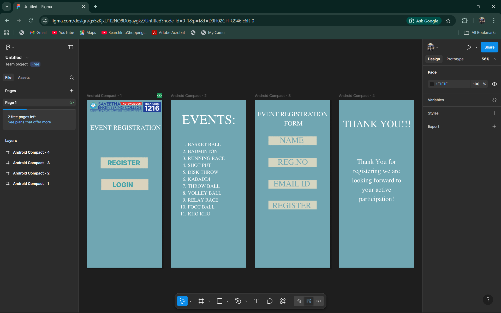

# Ex09 Event Registration Web Application
## Date:20/11/2025

## AIM:
To design, develop and deploy a web application for event registration.

## DESIGN STEPS:

### Step 1:
Create a new frame.

### Step 2:
Select any one preset size of your choice.

### Step 3:
Select the shapes you need.

### Step 4:
Import images as needed.

### Step 5:
Create pages based on your need and link them.

### Step 6:

Validate the HTML and CSS code.

### Step 6:

Publish the website in the given URL.

## DESIGN TOOL:
Figma

## CODE:
HOME PAGE

html:
```
<!DOCTYPE html>
<html lang="en">
<head>
    <meta charset="UTF-8">
    <meta name="viewport" content="width=device-width, initial-scale=1.0">
    <title>Event Registration</title>
    <link rel="stylesheet" href="style.css">
</head>
<body>

<div class="container">

    <!-- HEADER -->
    <div class="header">
        
        
    </div>

    <!-- TITLE -->
    <h1 class="title">EVENT REGISTRATION</h1>

    <!-- BUTTONS -->
    <div class="btn-group">
        <button class="btn">REGISTER</button>
        <button class="btn">LOGIN</button>
    </div>

</div>

</body>
</html>
```
css:
```
* {
    margin: 0;
    padding: 0;
    box-sizing: border-box;
    font-family: "Arial", sans-serif;
}

body {
    background: #3DB7C6;     /* teal gradient background */
    display: flex;
    justify-content: center;
    align-items: center;
    height: 100vh;
}

.container {
    width: 380px;
    background: #4BC4D3;
    padding: 25px;
    border-radius: 8px;
    text-align: center;
}

/* Header section */
.header {
    display: flex;
    justify-content: space-between;
    align-items: center;
}

.logo {
    width: 150px;
}

.tnea {
    width: 70px;
}

/* Title */
.title {
    margin-top: 40px;
    font-size: 22px;
    font-weight: bold;
    letter-spacing: 1px;
    color: white;
}

/* Buttons */
.btn-group {
    margin-top: 40px;
    display: flex;
    flex-direction: column;
    gap: 20px;
}

.btn {
    background: white;
    border: none;
    padding: 12px 0;
    width: 70%;
    margin: 0 auto;
    font-size: 18px;
    color: #1F7C89;
    font-weight: bold;
    border-radius: 5px;
    cursor: pointer;
}

.btn:hover {
    background: #e6e6e6;
}
```
EVENTS:

html:
```
<!DOCTYPE html>
<html lang="en">
<head>
  <meta charset="UTF-8">
  <meta name="viewport" content="width=device-width, initial-scale=1.0">
  <meta name="description" content="Exported from Figma">
  <title>Exported Figma Design</title>
  
  <link rel="stylesheet" href="styles.css">
</head>
<body>
<div class="android-compact-2-1">
<p class="text-2"><span class="text-white">EVENTS:</span></p>
<p class="text-3"><span class="text-white">BASKET BALL
BADMINTON
RUNNING RACE 
SHOT PUT
DISK THROW
KABADDI
THROW BALL
VOLLEY BALL
RELAY RACE
FOOT BALL
KHO KHO</span></p>
</div>

</body>
</html>
```
css:
```
@font-face {
  font-family: 'Jomolhari';
  src: url('fonts/jomolhari.woff2') format('woff2'),
       url('fonts/jomolhari.woff') format('woff');
  font-weight: normal;
  font-style: normal;
}
:root {
  --font-family-jomolhari: 'Jomolhari', sans-serif;
  --text-white: rgba(255, 255, 255, 1);
}

.text-white {
  color: var(--text-white);
}


/* CSS Reset */
* {
  margin: 0;
  padding: 0;
  box-sizing: border-box;
}

body {
  width: 100%;
  min-height: 100vh;
  overflow-x: hidden;
}

img {
  max-width: 100%;
  height: auto;
}

/* Prototype Links (v5.6.0) */
a.prototype-link {
  text-decoration: none;
  color: inherit;
  display: contents;
}

.text-2 {
  flex-grow: 0;
  flex-shrink: 1;
  flex-basis: auto;
  text-align: left;
  font-family: var(--font-family-jomolhari);
  font-weight: normal;
  font-size: 64px;
  text-decoration: none;
  text-transform: none;
  color: var(--text-white);
}

.text-3 {
  flex-grow: 0;
  flex-shrink: 1;
  flex-basis: auto;
  text-align: left;
  font-family: var(--font-family-jomolhari);
  font-weight: normal;
  font-size: 24px;
  text-decoration: none;
  text-transform: none;
  color: var(--text-white);
}

.android-compact-2-1 {
@media (max-width: 1440px) {
  .android-compact-2-1 {
    padding-left: 24px;
    padding-right: 24px;
  }
}

@media (max-width: 768px) {
  .android-compact-2-1 {
    padding-left: 16px;
    padding-right: 16px;
  }
}
  flex-grow: 0;
  flex-shrink: 1;
  flex-basis: auto;
  background-color: rgba(112, 166, 178, 1);
}
```
REGISTRATION FORM:

html:
```
<!DOCTYPE html>
<html lang="en">
<head>
    <meta charset="UTF-8">
    <meta name="viewport" content="width=device-width, initial-scale=1.0">
    <title>Event Registration Form</title>

    <!-- Link CSS -->
    <link rel="stylesheet" href="style.css">
</head>
<body>

    <div class="panel">
        <h1 class="title">EVENT REGISTRATION <br><small>FORM</small></h1>

        <form class="form">
            <div class="bar">
                <input type="text" placeholder="NAME">
            </div>

            <div class="bar">
                <input type="text" placeholder="REG.NO">
            </div>

            <div class="bar">
                <input type="email" placeholder="EMAIL ID">
            </div>

            <button class="btn-bar" type="submit">REGISTER</button>
        </form>
    </div>

</body>
</html>
```
css:
```
/* Main colors */
:root {
  --teal: #46c0d0;
  --teal-dark: #37a9b7;
  --pale: #f0eeec;
  --text: #2d7f87;
}

* {
  box-sizing: border-box;
  margin: 0;
  padding: 0;
}

body {
  height: 100vh;
  display: flex;
  justify-content: center;
  align-items: center;
  background: linear-gradient(#bfeff6, #5dc6d6);
  font-family: Georgia, serif;
}

/* Panel */
.panel {
  width: 350px;
  padding: 40px 20px;
  background: linear-gradient(var(--teal), var(--teal-dark));
  text-align: center;
  box-shadow: 0 6px 30px rgba(0, 0, 0, 0.25);
  border-radius: 3px;
  color: white;
}

/* Title */
.title {
  font-size: 28px;
  letter-spacing: 2px;
  margin-bottom: 30px;
  text-transform: uppercase;
}

.title small {
  font-size: 18px;
}

/* Form fields */
.form {
  display: flex;
  flex-direction: column;
  gap: 30px;
}

/* Pale box */
.bar {
  background: var(--pale);
  padding: 12px;
  border-radius: 2px;
}

.bar input {
  width: 100%;
  border: none;
  background: transparent;
  text-align: center;
  font-size: 28px;
  letter-spacing: 3px;
  font-family: inherit;
  color: var(--text);
  outline: none;
}

.bar input::placeholder {
  color: var(--text);
}

/* Register button */
.btn-bar {
  background: var(--pale);
  border: none;
  padding: 12px;
  width: 100%;
  font-size: 28px;
  letter-spacing: 4px;
  color: var(--text);
  cursor: pointer;
  font-family: inherit;
  border-radius: 2px;
  box-shadow: 0 2px 0 rgba(0, 0, 0, 0.15);
}

.btn-bar:active {
  transform: translateY(1px);
  box-shadow: none;
}
```
THANK YOU PAGE:

html:
```
<!DOCTYPE html>
<html lang="en">
<head>
  <meta charset="UTF-8">
  <meta name="viewport" content="width=device-width, initial-scale=1.0">
  <meta name="description" content="Exported from Figma">
  <title>Exported Figma Design</title>
  
  <link rel="stylesheet" href="styles.css">
</head>
<body>
<div class="android-compact-4-1">
<p class="text-2"><span class="text-white">THANK YOU!!!</span></p>
<p class="text-3"><span class="text-white">Thank You for registering we are looking forward to your active participation!</span></p>
</div>

</body>
</html>
```
css:
```
@font-face {
  font-family: 'Jomolhari';
  src: url('fonts/jomolhari.woff2') format('woff2'),
       url('fonts/jomolhari.woff') format('woff');
  font-weight: normal;
  font-style: normal;
}
:root {
  --font-family-jomolhari: 'Jomolhari', sans-serif;
  --text-white: rgba(255, 255, 255, 1);
}

.text-white {
  color: var(--text-white);
}


/* CSS Reset */
* {
  margin: 0;
  padding: 0;
  box-sizing: border-box;
}

body {
  width: 100%;
  min-height: 100vh;
  overflow-x: hidden;
}

img {
  max-width: 100%;
  height: auto;
}

/* Prototype Links (v5.6.0) */
a.prototype-link {
  text-decoration: none;
  color: inherit;
  display: contents;
}

.text-2 {
  flex-grow: 0;
  flex-shrink: 1;
  flex-basis: auto;
  text-align: left;
  font-family: var(--font-family-jomolhari);
  font-weight: normal;
  font-size: 48px;
  text-decoration: none;
  text-transform: none;
  color: var(--text-white);
}

.text-3 {
  flex-grow: 0;
  flex-shrink: 1;
  flex-basis: auto;
  text-align: center;
  font-family: var(--font-family-jomolhari);
  font-weight: normal;
  font-size: 32px;
  text-decoration: none;
  text-transform: none;
  color: var(--text-white);
}

.android-compact-4-1 {
@media (max-width: 1440px) {
  .android-compact-4-1 {
    padding-left: 24px;
    padding-right: 24px;
  }
}

@media (max-width: 768px) {
  .android-compact-4-1 {
    padding-left: 16px;
    padding-right: 16px;
  }
}
  flex-grow: 0;
  flex-shrink: 1;
  flex-basis: auto;
  background-color: rgba(112, 166, 178, 1);
}
```


## OUTPUT:



## RESULT:
The program to design, develop and deploy a web application for event registration is completed successfully.
